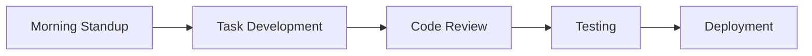

# Ipt2025AuthSystem
This project was generated with [Angular CLI](https://github.com/angular/angular-cli) version 18.2.1.

# 🚀 Team Roles & Responsibilities
> IPT 2025 Project Organization

## 👥 Team Overview

```ascii
+------------------------+    +------------------------+
|     FRONTEND TEAM     |     |     BACKEND TEAM       |
|------------------------|    |------------------------|
| ⭐ Renfred            |     | ⭐ Nathaniel          |
| ⭐ Jevy              |      | ⭐ Marneil            |
| ⭐ Arjane            |      |                        |
| ⭐ Aleson            |      |                        |
+------------------------+    +------------------------+
```

## 🎨 Frontend Warriors

### 🔐 Renfred | Authentication Specialist
```yaml
Role: Authentication & Account Module Lead
Primary Focus:
  - User authentication flows
  - JWT token management
  - Registration system
  - Account verification
Tools:
  - Angular 19
  - TypeScript
  - JWT
  - RxJS
```

### 👤 Jevy | Profile Management Expert
```yaml
Role: Profile & User Management Lead
Primary Focus:
  - User profile system
  - Settings management
  - Profile updates
  - Password management
Tools:
  - Angular Forms
  - NgRx
  - Material UI
  - Reactive Forms
```

### 👑 Arjane | Admin Portal Master
```yaml
Role: Admin Module Lead
Primary Focus:
  - Admin dashboard
  - User management interface
  - Analytics views
  - Role management UI
Tools:
  - Angular Material
  - Charts.js
  - Data Tables
  - Angular Guards
```

### 🎯 Aleson | UI/UX Architect
```yaml
Role: UI/UX & Components Lead
Primary Focus:
  - Component library
  - Responsive design
  - User experience
  - Error handling
Tools:
  - SCSS/SASS
  - Flex/Grid
  - Angular Animations
  - Error Interceptors
```

## ⚙️ Backend Titans

### 🛡️ Nathaniel | API Guardian
```yaml
Role: API & Security Lead
Primary Focus:
  - API architecture
  - Authentication system
  - Security middleware
  - Email integration
Tools:
  - Node.js
  - Express.js
  - JWT
  - Nodemailer
Key Responsibilities:
  - Design RESTful endpoints
  - Implement security measures
  - Handle API documentation
  - Manage authentication flows
```

### 🗄️ Marneil | Database Architect
```yaml
Role: Database & Operations Lead
Primary Focus:
  - Database design
  - CRUD operations
  - Data validation
  - Performance optimization
Tools:
  - MySQL
  - Sequelize ORM
  - SQL
  - Node.js
Key Responsibilities:
  - Schema design
  - Query optimization
  - Data integrity
  - Backup systems
```

## 🤝 Collaboration Guidelines

### Daily Workflow


### Communication Channels
- 📢 Daily Standups (9:00 AM)
- 💬 Discord Team Channel
- 📝 Jira Task Board
- 📥 Weekly Progress Reports

### Best Practices
- 📚 Document as you code
- 🧪 Write unit tests
- 🔍 Peer code review
- 🔄 Regular git commits
- 🎯 Follow style guides

## 🎯 Success Metrics
- Code Quality: 90%+ test coverage
- Performance: <2s page load time
- Security: 0 critical vulnerabilities
- Documentation: Complete API docs
- Collaboration: Daily commits

## 🚀 Project Milestones
1. Setup & Configuration
2. Core Features Development
3. Testing & QA
4. User Acceptance Testing
5. Deployment & Launch

---
*"Coming together is a beginning. Keeping together is progress. Working together is success."*


## Development server

Run `ng serve` for a dev server. Navigate to `http://localhost:4200/`. The application will automatically reload if you change any of the source files.

## Code scaffolding

Run `ng generate component component-name` to generate a new component. You can also use `ng generate directive|pipe|service|class|guard|interface|enum|module`.

## Build

Run `ng build` to build the project. The build artifacts will be stored in the `dist/` directory.

## Running unit tests

Run `ng test` to execute the unit tests via [Karma](https://karma-runner.github.io).

## Running end-to-end tests

Run `ng e2e` to execute the end-to-end tests via a platform of your choice. To use this command, you need to first add a package that implements end-to-end testing capabilities.

## Further help

To get more help on the Angular CLI use `ng help` or go check out the [Angular CLI Overview and Command Reference](https://angular.dev/tools/cli) page.
